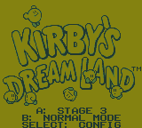
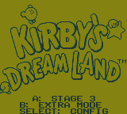
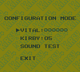
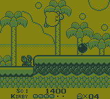

# Kirby's Dream Land - Level Select

A small quality-of-life ROM hack for **Kirby's Dream Land** on Nintendo Game Boy.

This patch adds a simple level select directly to the title screen while otherwise preserving the original game.

## Controls

On the title screen:

- **A** — Cycle through Stage 1–5
- **B** — Toggle Normal Mode / Extra Mode
- **SELECT** — Open the original Configuration Mode
- **START** — Begin the selected stage and mode

The original Extra Game and Configuration Mode secret codes are preserved.

## Patching

Apply either the `.bps` or `.ips` patch to a clean copy of:

**Kirby's Dream Land (USA, Europe)**

BPS is recommended.

Do not apply both patches.

https://www.romhacking.net/patch/

## Source ROM

CRC32: `40F25740`

MD5: `A66E4918EDCD042EC171A57FE3CE36C3`

SHA-1: `90979BAA1D0E24B41B5C304C5DDAF77450692D5A`

## Screenshots

| Normal Mode | Extra Mode | Configuration Mode | Gameplay |
| --- | --- | --- | --- |
|  |  |  |  |

## Download

See the **Releases** section for the packaged release.

## Notes

Configuration Mode behaves like the original game: Start does not launch a stage from that screen. Choose Exit to return to the title screen; your selected stage/mode and configuration settings are retained.

Tested in SameBoy 1.0.3, including all five stages, Normal and Extra Mode, Configuration Mode, original secret codes, held-button input, and long title-screen idle testing.

## Version

v1.0 — Initial release
